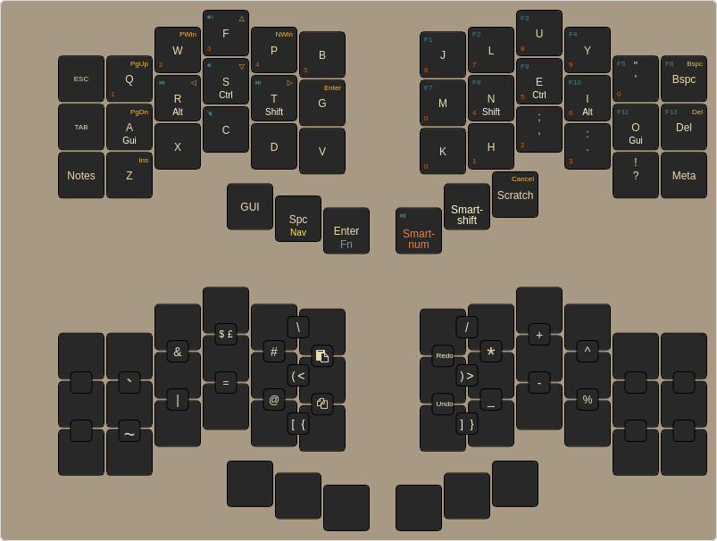

# zmk-config

This is my [ZMK firmware](https://github.com/zmkfirmware/zmk/)
configuration. It consists of a 42-keys base layout that is used for a Corneish Zen.

It is forked from [urob's](https://github.com/urob/zmk-config) amazing config.

## Keymap

